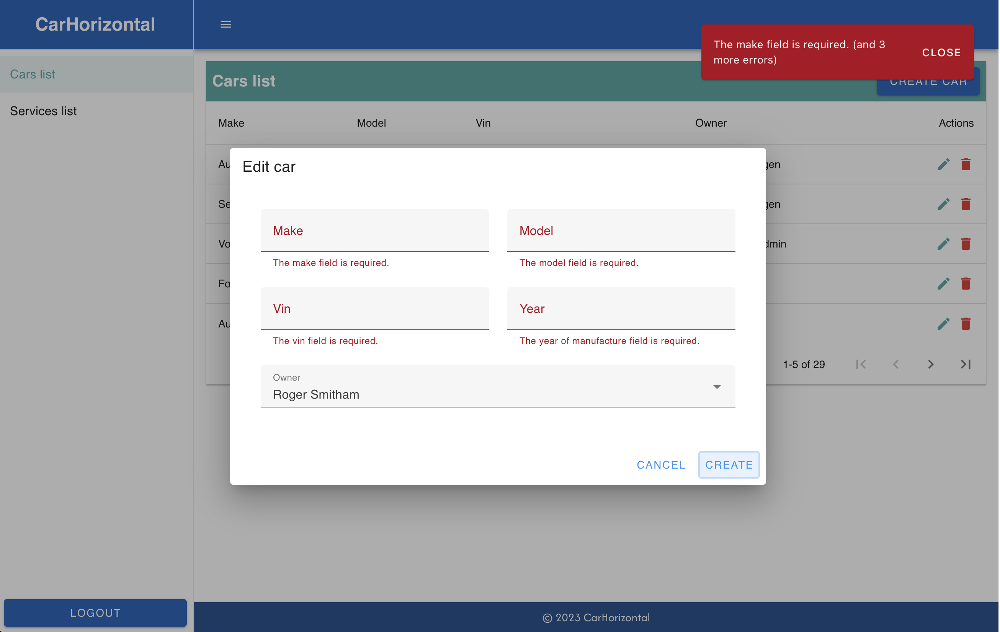

# CarHorizontal

## Sprendžiamo uždavinio aprašymas 

### Sistemos paskirtis

Projekto tikslas – rinkti informaciją apie automobilio aptarnavimų istoriją, taip palengvinant automobilio pirkimo/pardavimo procesą.

Sistemos pagrindiniai modeliai: naudotojas, servisas, automobilis, vizitas, aptarnavimo įrašas.

Klientai gali registruoti savo automobilį sistemoje ir peržiūrėti su juo susijusią informaciją (aptarnavimų istoriją). Sistemoje yra registruoti servisai, kuriems priklauso darbuotojai. Klientui atvežus automobilį į servisą, serviso darbuotojas pagal VIN numerį užregistruoja automobilį vizitui, klientas šią užklausą turi patvirtinti (taip apsisaugoma, kad servisas nepridėtų įrašų netinkamam automobiliui ar apskritai nepridėtų įrašų automobiliui, kurio net neaptarnauja). Po kliento patvirtinimo serviso darbuotojai gali peržiūrėti sąrašą automobilių, kurie priskirti servisui, o peržiūrėjus konkretų automobilį gali pridėti jam aptarnavimo įrašą, sutvarkius automobilį darbuotojas išregistruoja automobilį taip užrakindamas galimybę toliau keisti įrašus.

### Funkciniai reikalavimai

Svečias galės:
1.	Prisijungti
2.	Registruotis

Klientas galės:

1.	Užregistruoti automobilį sistemoje
2.	Peržiūrėti savo automobilių sąrašą
3.	Peržiūrėti automobilį
4.	Redaguoti automobilį
5.	Pašalinti automobilį
6.	Patvirtinti automobilio perdavimą servisui
7.  Peržiūrėti automobilio įrašus

Serviso darbuotojas galės:

1.	Užregistruoti automobilį servise.
2.	Išregistruoti automobilį iš serviso.
3.	Peržiūrėti automobilių esančių servise sąrašą.
4.	Peržiūrėti automobilį.
5.	Pridėti aptarnavimo įrašą automobiliui.
6.	Redaguoti aptarnavimo įrašą (tik pridėtus šio vizito metu)
7.	Trinti aptarnavimo įrašą (tik pridėtus šio vizito metu)

Sistemos administratorius galės:

1.	Peržiūrėti servisų sąrašą
2.	Sukurti servisą
3.	Peržiūrėti servisą
4.	Redaguoti servisą
5.	Pašalinti servisą
6.	Peržiūrėti naudotojų sąrašą
7.	Sukurti naudotoją
8.	Peržiūrėti naudotoją
9.	Redaguoti naudotoją
10.	Pašalinti naudotoją
11.	Peržiūrėti automobilių sąrašą
12. Sukurti automobilį
13. Peržiūrėti automobilį
14. Redaguoti automobilį
15. Pašalinti automobilį

## Sistemos architektūra
Sistemos pagrindinės dalys:
- Kliento dalis (angl. Front-End) – TypeScript, Nuxt 3, Vue 3.
- Serverio dalis (angl. Back-End) – PHP, Laravel. Duomenų bazė – MySQL.

Sistemos visumą sudarančios dalys (kliento ir serverio) talpinamos atskiruose serveriuose, kurios bendrauja tarpusavyje HTTP protokolu per 8080 prievadą. Sistemos naudotojas gali kreiptis tik į kliento dalį HTTP protokolu per 80 prievadą. O duomenų bazę pasiekti gali tik serverinė dalis MYSQL protokolu per 3306 prievadą.

## API routes dokumentacija
[Postman dokumentacija su pavyzdžiais](https://documenter.getpostman.com/view/29924563/2s9Ykq71MW)

## Wireframes
Puslapio struktūros wireframe:

Lentelės wireframe:

Automobilio redagavimo modalo wireframe:

Automobilio redagavimo modalo wireframe (mobiliajame telefone):
")

## Sistemos nuotraukos
Prisijungimo puslapis:

Kuriamas automobilio vizitas (automobilis yra sistemoje):

Kuriamas automobilio vizitas (automobilio nėra sistemoje):

Automobilių sąrašas:

Sukurti automobilį modalas:

Sukurti automobilį modalas su klaidomis:

Redaguoti automobilį modalas:

Redaguoti automobilį modalas mobiliajame telefone:

Navigacija mobiliajame telefone:

